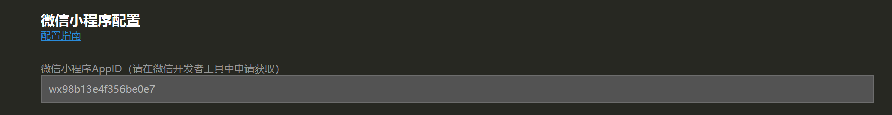
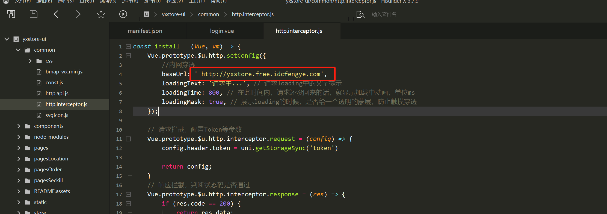

# 优选商城用户端

## 项目技术栈

使用UNI-APP开发

## 运行指引

### 1.配置小程序ID

此处的ID为个人在微信小程序申请的小程序ID,测试ID也可以

### 2.配置请求路径

> 有条件可以买服务器,部署后端,并且买域名并进行企业备案,服务器解析域名后,此时可以使用自己的域名作为baseUrl
>
> 如果没有,使用内网穿透与本地部署的后端端口进行映射,使用内网穿透的域名即可.

推荐内网穿透地址:https://www.ngrok.cc/

> 注意:服务器与身份认证都需要收费,身份认证是一次性的,2元即可,服务器需要到期续费

### 3.其他错误需要根据工具提示自行解决

