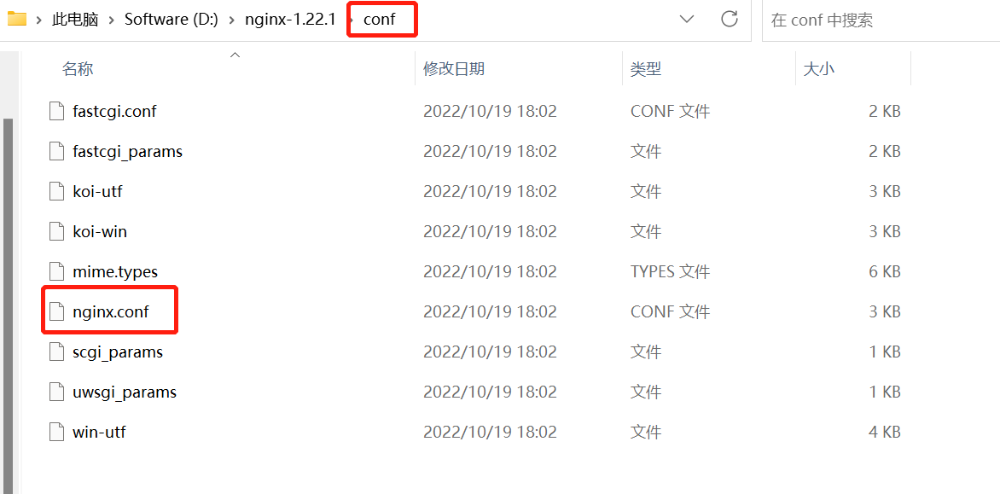
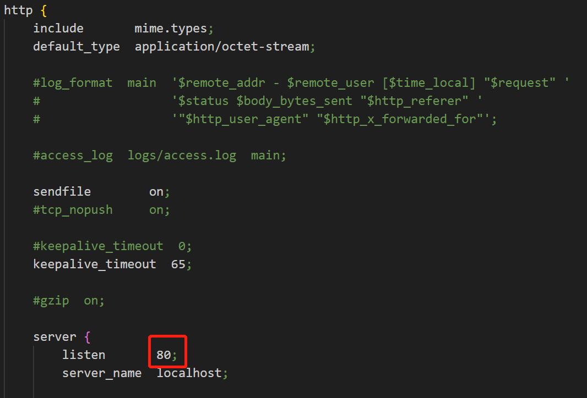
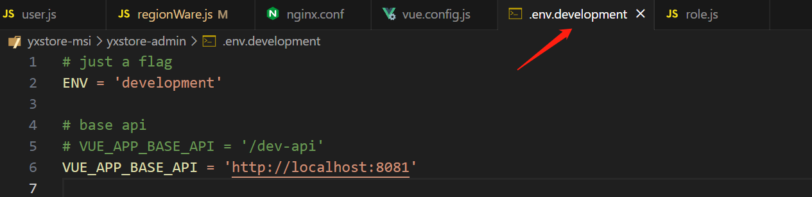
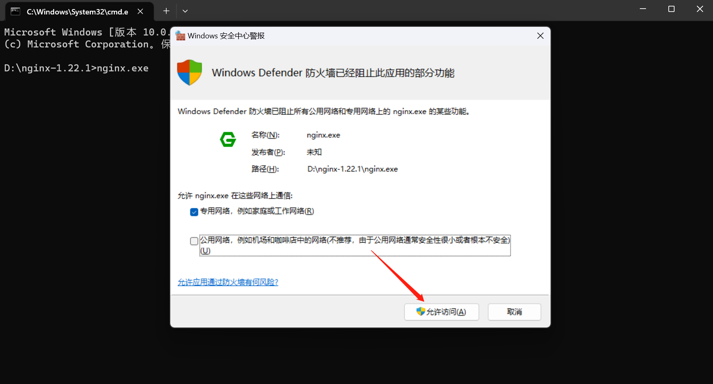
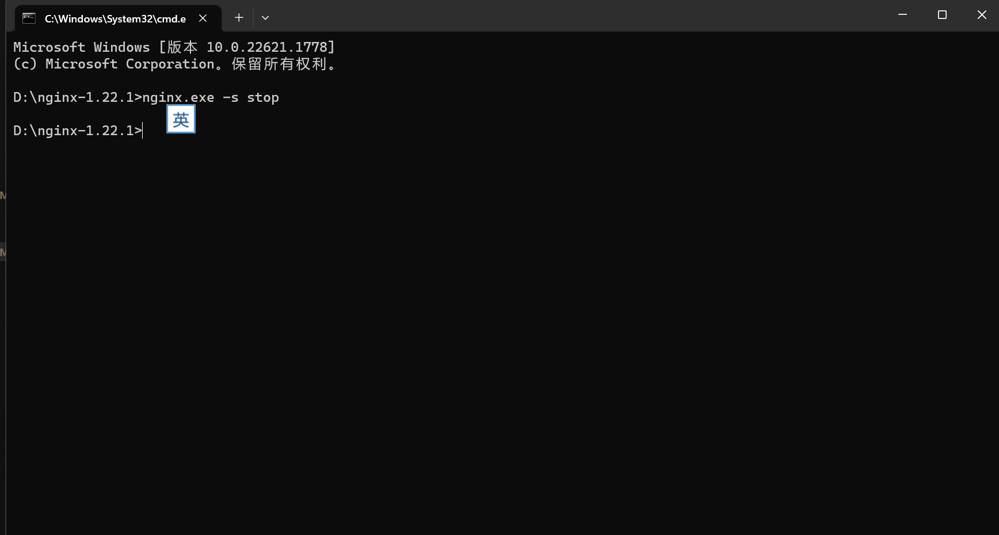

# 优选商城项目开发

## 项目架构

### 后端服务

SpringBoot+SpringCloud+SpringCloud Alibaba+Nacos+Redis+RabbitMQ+ElasticSearch+MyBatisPlus等

### 后台管理

Vue+ElementUI+vue-element-admin

### 用户端

微信小程序


## 后端模块划分

```text
store-
	  |common 公共组件
	  |generator 代码生成
	  		|common-util 公共工具类
	  		|service-util 微服务工具类
	  |model 存放实体类等
	  |service 微服务相关
	          | service-acl 用户角色权限管理
	          | service-sys 系统管理
```


## 整合Nginx

> 由于后端分多个模块,也有多个端口,前端配置时只能请求一个端口,为了解决不同模块的API请求端口问题,使用Nginx做反向代理

### 1.下载Nginx

[nginx: download](http://nginx.org/en/download.html)

> http://nginx.org/en/download.html
>
> 下载完成后解压到一个没有中文,没有空格的路径

### 2.配置反向代理



打开conf/下的nginx.conf文件

#### 2.1反向代理配置



http节点下的server中,listen后面代表监听的端口,此处默认80,但由于是开发环境,可能会与其他web容器冲突,可以选择改成其他端口,例如9090

```conf
server {
        listen       9090;
        server_name  localhost;
```

#### 2.2 前端BASE_API配置



env.development代表开发环境配置,这里我配置的是8081,因为权限管理模块就是8081端口,使用nginx时应该配置为跟nginx一样的端口,也就是9090

```xml
VUE_APP_BASE_API = 'http://localhost:9090'
```

#### 2.3代理配置

在ngnix.conf中配置请求的url对应的端口

```conf
    server {
        listen       9090;
        server_name  localhost;

        # 权限管理
        location ~ /acl/ {
            proxy_pass http://localhost:8081;
        }
        # 系统管理
        location ~ /sys/ {
            proxy_pass http://localhost:8082;
        }
```


### 3.启动/关闭nginx

> 在nginx安装路径,启动cmd

#### 3.1启动

```shell
nginx.exe
```

#### 3.2关闭

```shell
nginx.exe -s stop
```





> 注意;直接关闭cmd是无法关闭nginx的

## 代码下载与运行

### 分支

```text
yxstore
	   | master 后端
	   | msi-ui 管理端前端
	   | ui 用户端前端
```

### 下载

```shell
管理端前端
git clone -b msi-ui --single-branch https://gitee.com/xccit/yxstore.git
用户端
git clone -b ui --single-branch https://gitee.com/xccit/yxstore.git
后端
git clone -b master --single-branch https://gitee.com/xccit/yxstore.git
```

### 运行

> 后端:配置数据源,启动中间件
>
> 管理端:配置npm,运行npm install 
>
> 用户端:导入小程序源码

